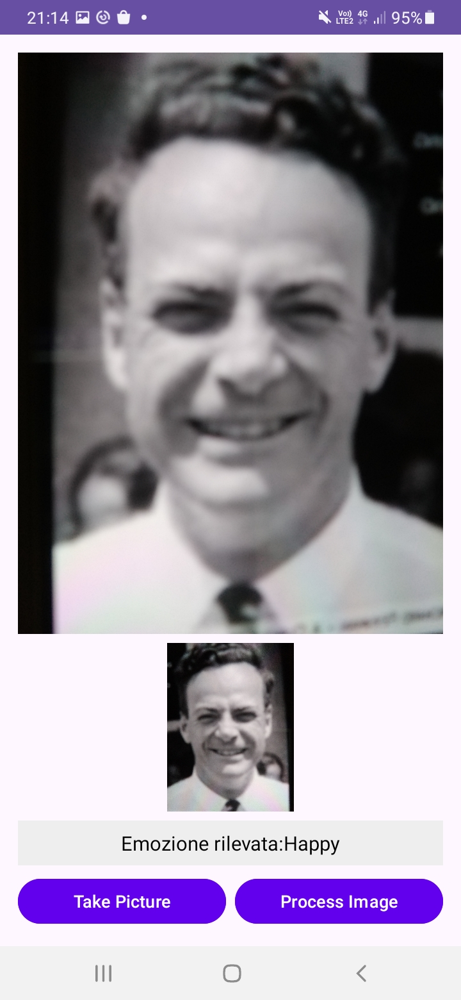

# EFace: Emotional Faces Recognition App

## <span style="color:blue;">Project Description</span>

The main objective is to develop an Android application for emotion recognition using a **Machine Learning** model optimized for mobile devices via **TensorFlow Lite**. The app allows users to:

1. Take a photo using the device's camera.
2. Process the image through a TFLite model to determine the predominant emotion.
3. Display the result directly on the user interface.
4. Automatically analyze emotions in video streams with frame sampling.

The model was trained using the **FER2013** dataset with advanced deep learning techniques, and its optimized format ensures high performance on mobile devices.

---

## <span style="color:blue;">Features</span>
- **Image Capture**: Utilizes CameraX to take photos using the front-facing camera.
- **Real-Time Inference**: Processes images using a convolutional neural network model.
- **Video Frame Processing**: Automates frame analysis every 2 seconds to recognize emotions in real-time video streams.
- **User-Friendly Interface**: Displays results directly in the app's text area.
- **Mobile Optimization**: Model optimized through quantization and parallelization.

---

## <span style="color:blue;">Requirements</span>

### For the Android App
- Android Studio (version >= 2022.1.1)
- Gradle (version >= 7.4)
- Device with Android 6.0 (API 23) or higher

### For Model Training
- Python >= 3.8
- TensorFlow >= 2.9
- Additional libraries:
  - `numpy`
  - `scikit-learn`
  - `pillow`

---

## <span style="color:blue;">Project structure</span>

### Main Directories
- **`app/`**: Source code for the Android app.
  - `src/main/assets`: Optimized model in TFLite format (`emotion_model.tflite`).
  - `res/layout`: XML layouts for the user interface.
  - `java/com/example/emotionalfaces`: Application logic.
- **`models/`**: Contains files generated during training, including:
  - `best_emotion_model.keras`: Trained model.
  - `emotion_model.tflite`: Optimized model for mobile devices.
- **`datasets/`**: Dataset used for training (FER2013).

### Key Files
- **`MainActivity.java`**: Android app logic.
- **`TFmodel.py`**: Script for training and converting the model.
- **`FEdataset.py`**: Script for loading and preprocessing the FER2013 dataset.

---
## <span style="color:blue;">Installation and Usage</span>

### 1. Android App

#### **Environment Setup**
1. Open the project in Android Studio.
2. Synchronize the Gradle files.
3. Add the `emotion_model.tflite` file to the `app/src/main/assets` directory (already included in the project).

#### **Execution**
1. Connect an Android device or use an emulator.
2. Press the **Run** button (green triangle) in Android Studio.
3. Launch the app on the device and explore its features.

---

### 2. Model Training

#### **Requirements**
Ensure the following Python dependencies are installed:
```bash
pip install numpy scikit-learn pillow tensorflow
```

#### **Model Training**
1. Download the FER2013 dataset and place it in the `datasets/fer2013.zip` directory.
2. Run the `TFmodel.py` script:
   ```bash
   python TFmodel.py
   ```
3. The trained model will be saved in `.keras` and `.tflite` formats in the `models/` directory.

---

## <span style="color:blue;">Technical Details</span>

### **Machine Learning Model**
- Architecture: Convolutional Neural Network (CNN)
  - 3 convolutional blocks with batch normalization and dropout.
  - Fully connected layers with `ReLU` and `softmax` activation.
- Input: Grayscale images, size 48x48.
- Output: 7 emotion classes (`angry`, `disgust`, `fear`, `happy`, `neutral`, `sad`, `surprise`).

### **TFLite Quantization**
- **Hybrid quantization (int8 and float16)** for optimized performance.
- Data representative configured to ensure high accuracy.

### **Video Frame Processing**
- Captures frames every 2 seconds for real-time emotion analysis.
- Updates the UI dynamically without user interaction.

### **Parallelization**
- **Preprocessing on CPU:** Uses multithreading for efficient image data preparation.
- **Inference on GPU:** Utilizes NNAPI for accelerated tensor calculations on compatible hardware.

### **Dataset**
- **Name**: FER2013 (Facial Expression Recognition 2013)
- **Format**: ZIP file organized into directories for emotion categories.
- **Preprocessing**:
  - Conversion to grayscale.
  - Pixel normalization (0-1).
  - Split into training (80%) and testing (20%).

---

## <span style="color:blue;">Conclusion</span>

This project demonstrates the effectiveness of emotion recognition using convolutional neural networks and its integration on mobile devices. The combination of an intuitive Android app, advanced parallelization, frame processing, and quantization techniques represents a step forward in real-world AI-based applications.

---

## Example

<div style="display: flex; justify-content: center; gap: 10px;">
  
  
</div>

---

## License
This project is distributed under the MIT License. See the `LICENSE` file for more details.
